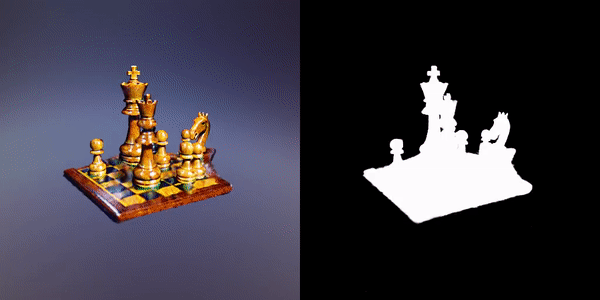
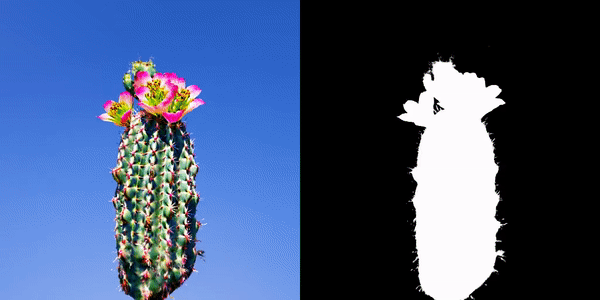
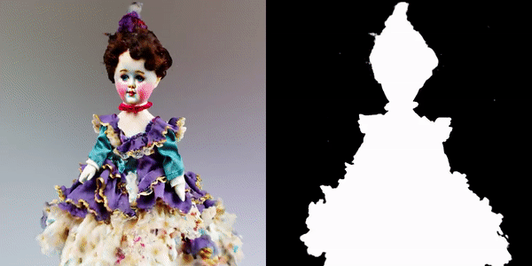
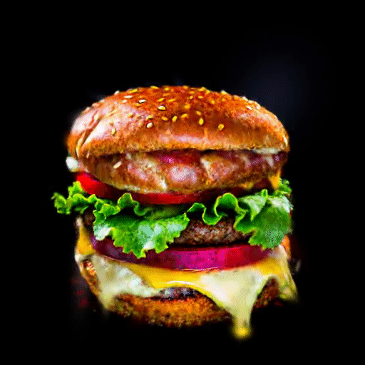
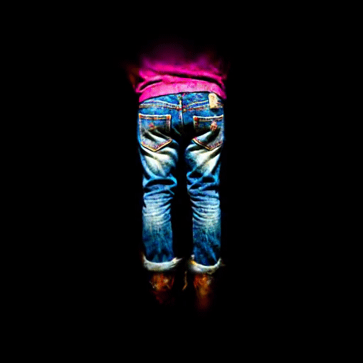
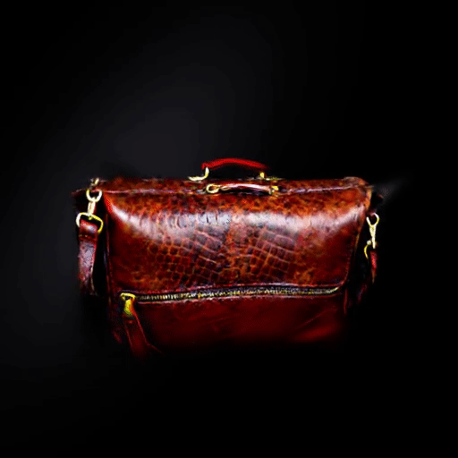

<div class="columns is-centered has-text-centered">
    <div class="column is-four-fifths">
        <h2>Abstract</h2>
        <div class="content has-text-justified">
We propose a unified framework aimed at enhancing the diffusion priors for 3D generation tasks. Despite the critical importance of these tasks, existing methodologies often struggle to generate high-caliber results. We begin by examining the inherent limitations in previous diffusion priors. We identify a divergence between the diffusion priors and the training procedures of diffusion models that substantially impairs the quality of 3D generation. To address this issue, we propose a novel, unified framework that iteratively optimizes both the 3D model and the diffusion prior. Leveraging the different learnable parameters of the diffusion prior, our approach offers multiple configurations, affording various trade-offs between performance and implementation complexity. Notably, our experimental results demonstrate that our method markedly surpasses existing techniques, establishing new state-of-the-art in the realm of text-to-3D generation. Furthermore, our approach exhibits impressive performance on both NeRF and the newly introduced 3D Gaussian Splatting backbones. Additionally, our framework yields insightful contributions to the understanding of recent score distillation methods, such as the VSD and DDS loss.        </div>
    </div>
</div>


## Performance on T3Bench (with NeRF)


| Dataset      | Dreamfusion | Magic3D | LatentNeRF | Fantasia3D | SJC  | ProlificDreamer | LODS Emb. | LODS LoRA |
|:------------:|:-----------:|:-------:|:----------:|:----------:|:----:|:---------------:|:---------:|:---------:|
| Single Obj.  |     24.4    |   37.0  |    33.1    |    26.4    | 24.7 |       49.4      |  **52.3** |    51.3   |
| Surroundings |     24.6    |   35.4  |    30.6    |    27.0    | 19.8 |       44.8      |  **49.8** |    47.3   |
| Multi. Obj.  |     16.1    |   25.7  |    20.6    |    18.5    | 11.7 |       35.8      |  **39.7** |    37.5   |
| Average      |     21.7    |   32.7  |    28.1    |    24.0    | 18.7 |       43.3      |  **47.3** |    45.4   |

We achieve state-of-the-art performance on T3Bench.

## Generation Results (NeRF)

<table style="border: none;">
  <tr>
    <td style="text-align: center;">
      
      <br><em>A red and white lighthouse on a cliff</em>
    </td>
    <td style="text-align: center;">
      
      <br><em>An intricately-carved wooden chess set</em>
    </td>
  </tr>
  <tr>
    <td style="text-align: center;">
      
      <br><em>A cactus with pink flowers</em>
    </td>
    <td style="text-align: center;">
      
      <br><em>A vintage porcelain doll with a frilly dress</em>
    </td>
  </tr>
</table>

## Generation Results (3D Gaussian Splatting)

<table style="border: none;">
  <tr>
    <td style="text-align: center;">
      
      <br><em>A DSLR image of a hamburger</em>
    </td>
    <td style="text-align: center;">
      
      <br><em>A pair of worn-in blue jeans</em>
    </td>
  </tr>
  <tr>
    <td style="text-align: center;">
      
      <br><em>A worn-out leather briefcase</em>
    </td>
    <td style="text-align: center;">
      
      <br><em>An ivory candlestick holder</em>
    </td>
  </tr>
</table>


## Citation
```
@article{yang2023lods,
  title={Learn to Optimize Denoising Scores for 3D Generation},
  author={Xiaofeng Yang, Yiwen Chen, Cheng Chen, Chi Zhang, Yi Xu, Xulei Yang, Fayao Liu and Guosheng Lin},
  journal={arXiv:2312.04820},
  year={2023}
}
```
